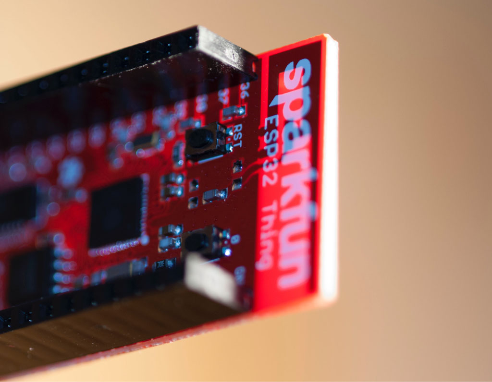
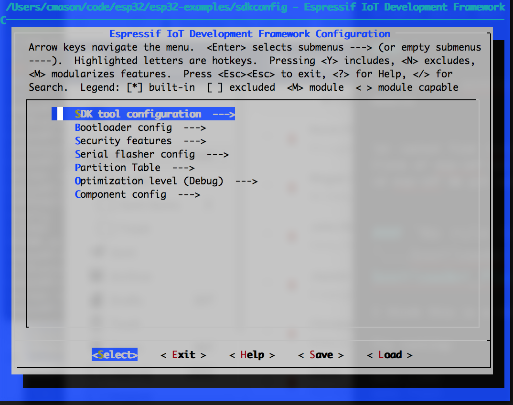
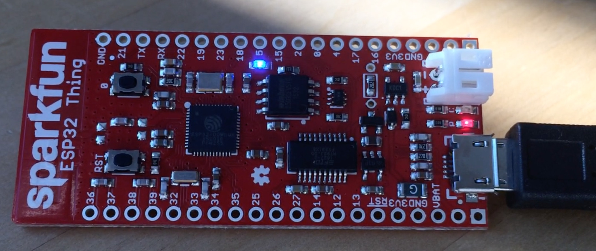
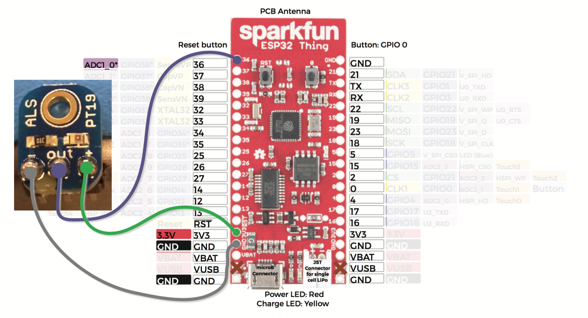
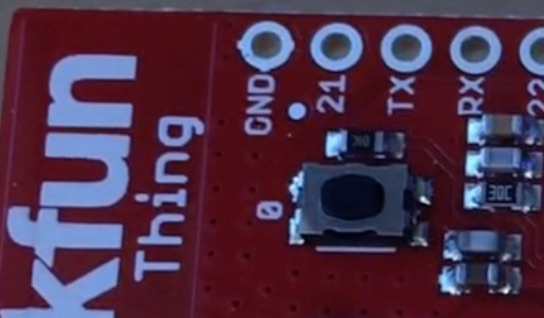

# ESP-32 Examples

A **handful of simple examples for the [ESP-32](http://esp32.net/)**.

### Table of contents

* [Introduction](#introduction)
* [Requirements / Setup](#requirements-setup)
* [Examples](#examples)
* [Next Steps](#next-steps)
* [Troubleshooting](#troubleshooting)

## Introduction


This repo contains number of simple examples for the [ESP-32](http://esp32.net/), including:

* General Purpose Input Output (GPIO, aka "digital pins"), using [functions](main/main_gpio.c) and [direct register access](main/main_),
* Analog to Digital converter (ADC), for light sensor or soil moisture sensor,
* Arduino compatibility,
* Dallas One Wire temperature sensor, 
* Push button w/ interrupt.

These examples are described in detail [below](#examples).


This repository contains companion code to a talk I gave about Microcontrollers.  The [talk](assets/Sushi_and_Solder_2_ESP_32.pdf), and these examples, are based around the SparkFun [ESP-32 Thing](https://www.sparkfun.com/products/13907), but any ESP32 dev board should work, with some changing of pins.


The layout of this repository is based on the [ESP IDF Template](https://github.com/espressif/esp-idf-template).

## Requirements / Setup

* ESP-32 hardware, in particular the [SparkFun ESP-32 Thing](https://www.sparkfun.com/products/13907),
* [ESP-IDF](https://github.com/espressif/esp-idf) repo (see details below),
* Some familiarity with command line tools,
* A microusb cable,
* Some examples require additional sensors, described therein.

### Installation Steps

*IMPORTANT*: both repository and the ESP-IDF repository have submodules, so must be cloned with `--recursive`.

Install and configure the [ESP-IDF](https://github.com/espressif/esp-idf) (the SDK for ESP32 development), including downloading the GCC compiler and possibly installing Xcode, and either MacPorts or Homebrew.  Please see detailed installation instructions there, but in summary, for Mac:


```
mkdir esp32
cd esp32 
git clone --recursive https://github.com/espressif/esp-idf
# Double check that the below compiler version is the most recent mentioned in ESP-IDF setup instructions:
wget https://dl.espressif.com/dl/xtensa-esp32-elf-osx-1.22.0-61-gab8375a-5.2.0.tar.gz
tar xzf xtensa-esp32-elf-osx-1.22.0-61-gab8375a-5.2.0.tar.gz
export PATH=`pwd`/xtensa-esp32-elf/bin:${PATH}
export IDF_PATH=`pwd`/esp-idf
git clone --recursive https://github.com/cmason1978/esp32-examples
```

Plug the ESP32 board into your USB port, and run:

```
ls /dev/tty.*
```

You should see a device name like `/dev/tty.usbserial-DN0281FC` (the letters at the end will be different).  This is the "device" file used for talking to the board over the USB serial port.  If you don't see anything like this, go to [troubleshooting](#troubleshooting) below.  If you have more than one, try unplugging and seeing which disappears.  Note that, in some cases, the name of the device will change if you plug it into a different USB port. 

Next, type:

```
make menuconfig
```

This will show a graphical configuration screen like this:



Use the up and down arrow keys to navigate menus at the middle of the screen and the left and right arrow keys to navigate the buttons along the bottom.  Press enter to select.

Under "Serial flasher config", change the "Default serial port" to the `/dev/tty...` path you discovered above.  Change the "Flash size" to 4MB (for SparkFun board).


Choose "Exit" repeatedly and save the configuration.

Now run:

```
make flash
```

This compiles both the ESP IDF libraries and the example main file locally (into the `build` directory) and then downloads this to the flash memory on the device over USB.  It will take a little while, both to compile, and to flash.  If you have a multi-core machine you can try adding eg `-j 4` to speed up compilation. 

After this completes the blue LED on your board should be flashing twice per second. 



Now run:
```
make monitor
```

This will connect over the serial port and reboot the device, and you should see a bunch of debugging output ending with "Hello, world"

```
...
I (943) cpu_start: Pro cpu up.
I (955) cpu_start: Starting app cpu, entry point is 0x400809bc
I (0) cpu_start: App cpu up.
I (986) cpu_start: Pro cpu start user code
I (1235) phy: phy_version: 258, Nov 29 2016, 15:51:07, 1, 0
I (2258) cpu_start: Starting scheduler on PRO CPU.
Hello, world.
I (1292) cpu_start: Starting scheduler on APP CPU.
Hello, world.
Hello, world.
Hello, world.
Hello, world.
```

Type Ctrl-] to break out of the terminal.

If you successfully flash the device at the default baud rate (115200), you can speed up the flash process significantly by choosing one of the faster baud rates in `make menuconfig` > Serial flasher config > Default baud rate. I occasionally get errors at 2MBaud, but rerunning the flash command will usually succeed.


See [below](#troubleshooting) for troubleshooting suggestions.


## Examples

### Choosing which example to run

The template IDF project is set up to only run a single program.  We have a number of different examples here.  By default the [`main/main_gpio.c`](main/main_gpio.c) example will run, which blinks the LED and writes.

To choose which example to run, edit the `main/component.mk` file and change which one of the `COMPONENT_OBJS` lines is commented in.


### GPIO Blink LED

`main/main_gpio.c` – blinks the LED 2/sec and prints "Hello, world!" to serial console.  Demonstrates use of gpio functions.

### GPIO Blink LED, raw register version


`main_gpio_raw.c` – Demonstrates use of direct register access to control the LED.

### Demonstrate debugger

`main_crash.c` – Demonstrates use of GDB debugger.

When your program crashes, by default you'll see something like this:

```
Guru Meditation Error of type LoadProhibited occurred on core  0. Exception was unhandled.
Register dump:
PC      : 0x400e6919  PS      : 0x00060330  A0      : 0x800d06dd  A1      : 0x3ffb7c60  
A2      : 0x00000001  A3      : 0x00000000  A4      : 0x00060023  A5      : 0x3ffb7d24  
A6      : 0x00000000  A7      : 0x00000001  A8      : 0x800e6919  A9      : 0x3ffb7c40  
A10     : 0x0000000a  A11     : 0x3ffb1bec  A12     : 0x00060023  A13     : 0x3ffb91c0  
A14     : 0x00000003  A15     : 0x00060023  SAR     : 0x0000001b  EXCCAUSE: 0x0000001c  
EXCVADDR: 0x00000000  LBEG    : 0x400014fd  LEND    : 0x4000150d  LCOUNT  : 0xfffffffc  

Backtrace: 0x400e6919:0x3ffb7c60 0x400d06dd:0x3ffb7c90
```


This is a register dump and execution traceback.  This is produced by FreeRTOS whenever a task crashes.  The "backtrace" line allows you to figure out where it crashed.  There are pairs of addresses separated by colons; pass the first address of the pair to `addr2line`:

```
xtensa-esp32-elf-addr2line -e build/app-template.elf 0x400e6919
/Users/cmason/code/esp32/esp32-examples/main/./main_crash.c:21 (discriminator 1)
```

You may need to walk up the stack in order to find your code (but see below for an easier way using GDB).


By default a crash reboot the device, which is useful in a real device but is annoying when debugging.  This may happen in a loop quickly (see [this troubleshooting answer](#My-program-is-crashing-in-a loop-and-I-can-t-get-the-device-to-flash) if you have trouble breaking out of this loop).

However, you can change this behavior and even connect a debugger!


First enable the GDB debug stub by: `make menuconfig` > Component config > ESP32-specific config > Panic handler behavior, and choose "Invoke GDBStub".

Now when your program crashes, after the backtrace you'll see:

```
Entering gdb stub now.
$T0b#e6
```

Exit out of the monitor by pressing Ctrl-] and then connect gdb by running:

```
xtensa-esp32-elf-gdb ./build/app-template.elf -b 115200 -ex 'target remote /dev/cu.usbserial-DN0281FC'
```
Substitute your device name here, and note `cu` and not `tty` (or you'll hang when connecting with GDB).

For example:


```
cmason@fire:~/code/esp32/esp32-examples> xtensa-esp32-elf-gdb ./build/app-template.elf -b 115200 -ex 'target remote /dev/cu.usbserial-DN0281FC'
GNU gdb (crosstool-NG crosstool-ng-1.22.0-61-gab8375a) 7.10
Copyright (C) 2015 Free Software Foundation, Inc.
License GPLv3+: GNU GPL version 3 or later <http://gnu.org/licenses/gpl.html>
This is free software: you are free to change and redistribute it.
There is NO WARRANTY, to the extent permitted by law.  Type "show copying"
and "show warranty" for details.
This GDB was configured as "--host=x86_64-build_apple-darwin16.0.0 --target=xtensa-esp32-elf".
Type "show configuration" for configuration details.
For bug reporting instructions, please see:
<http://www.gnu.org/software/gdb/bugs/>.
Find the GDB manual and other documentation resources online at:
<http://www.gnu.org/software/gdb/documentation/>.
For help, type "help".
Type "apropos word" to search for commands related to "word"...
Reading symbols from ./build/app-template.elf...done.
Remote debugging using /dev/cu.usbserial-DN0281FC
app_main () at /Users/cmason/code/esp32/esp32-examples/main/./main_crash.c:21
21	        volatile uint32_t foo = *(uint32_t*)0;
(gdb) 
```

You're now at the GDB prompt.  [GDB commands](https://www.tutorialspoint.com/gnu_debugger/gdb_commands.htm) include

`bt` will give a "back trace" of where the error occured

```
(gdb) bt
#0  app_main () at /Users/cmason/code/esp32/esp32-examples/main/./main_crash.c:21
#1  0x400d06dd in main_task (args=0x0)
    at /Users/cmason/code/esp32/esp-idf/components/esp32/./cpu_start.c:256
```

You can inspect memory and print variables:

```
(gdb) p foo
$1 = 0
(gdb) p level
$1 = 1
```

Type `quit` to exit.


### Analog to digital converter (ADC)

`main_adc.c` – Use the ADC, for instance with a light sensor.

Hook up [ALS-PT19](https://cdn-shop.adafruit.com/product-files/2748/2748+datasheet.pdf) ambient light sensor as shown below:




## Next Steps

* Read docs for the [ESP IDF](http://esp-idf.readthedocs.io/en/latest/).  These are still under development.
* Visit [ESP32 Forum](http://www.esp32.com/).  Good place to ask about undocumented or under documented things.
* For low level details of the chip, see the [datasheet](https://www.espressif.com/sites/default/files/documentation/esp32_datasheet_en.pdf) and the [technical reference manual](https://espressif.com/sites/default/files/documentation/esp32_technical_reference_manual_en.pdf).
* Learn about [FreeRTOS](http://www.freertos.org/), the real time operating system used on ESP32.
* Learn more about electronics.  I recommend [Practical Electronics for Inventors](https://www.amazon.com/Practical-Electronics-Inventors-Fourth-Scherz/dp/1259587541).
* Attempt your own project!  I'd love to hear what you work on!

## Troubleshooting


### No /dev device appears when I plug into USB

Try installing the [FTDI VCP drivers](http://www.ftdichip.com/Drivers/VCP.htm), eg [this one](http://www.ftdichip.com/Drivers/VCP/MacOSX/FTDIUSBSerialDriver_v2_3.dmg) for recent macs.


### `Timed out waiting for packet header` immediately when flashing the device for the first time.

I *think* this is due to bad drivers, but might also be a hardware/cable problem.  First try a different USB cable.

Next, double check that you can indeed talk to the device, for instance by running `make monitor` or `screen /dev/tty... 115200`.  If you see weird unprintable characters, or you can't connect, try installing the FTDI driver as [described above](#No--dev-device-appears-when-I-plug-into-USB).

Also, double check that you don't have old USB serial drivers (for instance by doing `ls -1 /Library/Extensions | grep -i '(usb)|(prolific)'`).

### `Timed out waiting for packet header` in the middle of flashing.

Retry flashing, or reduce the baud rate.


### `No module named serial`

Missing the pyserial module:

```
pip install pyserial
```


### `pip: command not found`

[Install PIP](http://stackoverflow.com/questions/17271319/how-to-install-pip-on-mac-os-x).


### `project.mk: No such file or directory`

Your `IDF_PATH` environment variable isn't set to the path to the ESP-IDF repository.  Double check this path.


### Make asks me a bunch of questions I don't know the answers to.

This happens after updating the ESP-IDF if new options are added.  Accept the defaults by pressing ENTER (not necessarily answering Yes).


### Stuff about keys/crypto

Disable secure boot in menuconfig.


### `ld: cannot find -lrtc `

Clone of esp-idf not recursive.  Can fix this by doing:

```
cd esp-idf && git submodule update --init
```


### `No rule to make target '...bootloader_flash.c', needed by `src/bootloader_flash.o'.`

I think this is due to a change in the SDK.

Try running:
```
make clean
make flash
```

### `No such file or directory: '/dev/tty.usbserial-...'`

The wrong device port is specified.

Run `make menuconfig` again and edit the "Serial flasher config > Default serial port.

-Or- edit the `sdkconfig` file and change the value of `CONFIG_ESPTOOLPY_PORT`.


### `miniterm.py: error: no such option: --raw`

The version of pyserial is too old. Try upgrading:

```
pip install pyserial --upgrade
```


### `Arduino.h not found`

This repository wasn't cloned recursively (using `--recursive`).  You can fix this by running, in this directory:

```
git submodule update --init
```

### Compilation error involving `esp32-hal-spi.c`.

Remove that file. I think this is mismatch between arduino and the ESP-IDF, but I haven't had time to debug yet.

### My program is crashing in a loop and I can't get the device to flash

Try holding down the bootloader button attached to pin 0 (labeled "0" on the ESP32 thing) while plugging the device into USB.  This should get you into the ROM bootloader, allowing you to flash.


